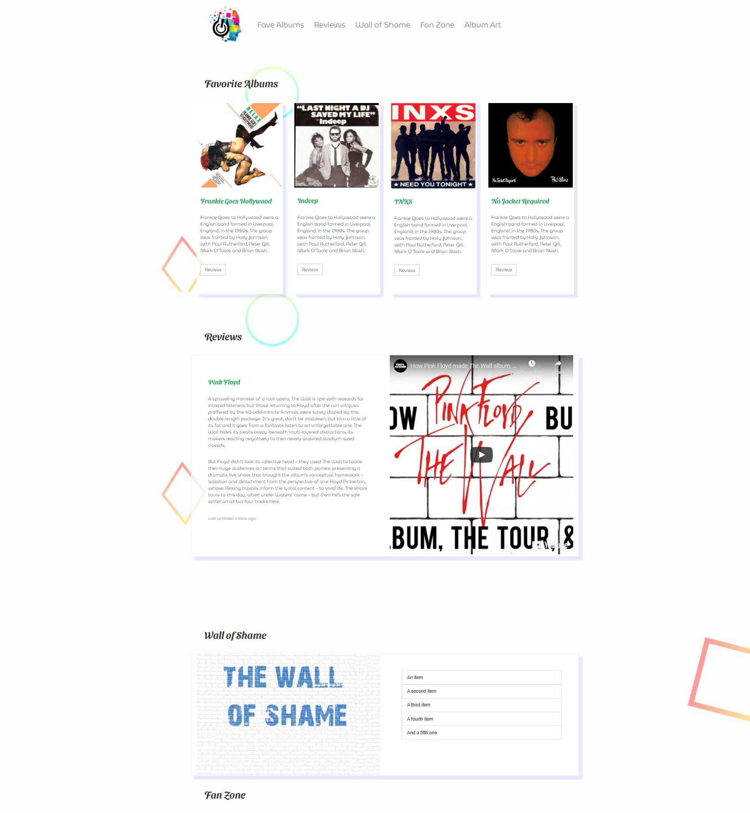

# Project - Artist News

> Our first Bootstrap5 project used to wet our feet using bootstraps standard components, no major frontend framework implemented, just a simple bootstrap one pager.

Standard boostrap5, used the CDN to serve the css and javascript, will implement a build process in the next project.

## Built With

- Major languages - HTML, CSS, Javascript(ES6)
- Frameworks - Bootstrap5
- Technologies - Netlify

## Live Demo

[Live Demo Link](https://strive-module2-day2.netlify.app/)

## Getting Started

**Git clone the repository and use live server or a simple server to serve the index.html in your browser, alternatively just open a browser and navigate to the cloned repo and launch index.html from there.**

To get a local copy up and running follow these simple example steps.

### Prerequisites

### Setup

### Install

### Usage

### Run tests

### Deployment

## Authors

👤 **Author1**

- GitHub: [@githubhandle](https://github.com/gonextnode)
- Twitter: [@twitterhandle](https://twitter.com/gonextnode)
- LinkedIn: [LinkedIn](https://linkedin.com/seanknowlesmd)

👤 **Author2**

## 🤝 Contributing

Contributions, issues, and feature requests are welcome!

Feel free to check the [issues page](issues/).

## Show your support

Give a ⭐️ if you like this project!

## Acknowledgments

- Hat tip to anyone whose code was used
- Inspiration
- etc

## 📝 License

This project is [MIT](lic.url) licensed.
